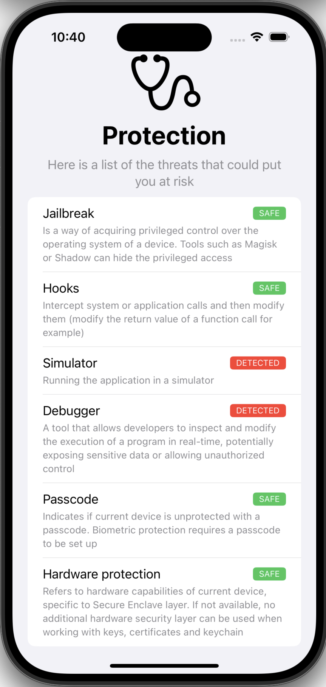

# Mobile Security Toolkit


[](https://swiftpackageindex.com/EXXETA/iOS-Security-Toolkit)
[](https://swiftpackageindex.com/EXXETA/iOS-Security-Toolkit)




In a world where mobile devices hold vast amounts of personal and 
business-critical data, security is no longer optional — it's essential.

iOS Security Toolkit is an open-source project designed to work on mobile security by 
providing a developer-friendly, all-in-one repository for developers and 
security experts.

This project is based on the [OWASP guide](https://github.com/MobSF/owasp-mstg/blob/master/Document/0x06j-Testing-Resiliency-Against-Reverse-Engineering.md)
to the mobile security.

## Features

Already implemented Features are:
- [x] Jailbreak or Root Detection
- [x] Hooks Detection
- [x] Simulator Detection
- [x] Debugger Detection
- [x] Device Passcode Check
- [x] Hardware Security Check

You can see them in action with the [Example App](./SecurityToolkitExample) we've provided

## Installation

You can use the Mobile Security Toolkit in your project by importing it with 
Swift Package Manager

### SPM

`.package(url: "https://github.com/EXXETA/iOS-Security-Toolkit.git", from: 
"2.0.0")`

## CocoaPods

[CocoaPods](https://cocoapods.org) is a dependency manager for Cocoa projects. For usage and installation instructions, visit their website. To integrate iOSSecurityToolkit into your Xcode project using CocoaPods, specify it in your `Podfile`:

```ruby
pod 'SecurityToolkit'
```

## Usage

### Variable API

Use the gettable variables to get current status of the device:

- `ThreatDetectionCenter.areRootPrivilegesDetected: Bool`
- `ThreatDetectionCenter.areHooksDetected: Bool`
- `ThreatDetectionCenter.isSimulatorDetected: Bool`
- `ThreatDetectionCenter.isDebuggerDetected: Bool`
- `ThreatDetectionCenter.isDeviceWithoutPasscodeDetected: Bool`
- `ThreatDetectionCenter.isHardwareProtectionUnavailable: Bool`

### Async Stream API

Use Async Stream API to get detected threats asynchronously:

- `ThreatDetectionCenter.threats: AsyncStream<Threat>`

## Testing

To run the available tests locally or in the pipeline use `xcodebuild test -scheme SecurityToolkitTests -destination 'platform=iOS Simulator,name=iPhone 16 Pro,OS=18.0'`

## Roadmap

Next features to be implemented:
- [ ] App Signature Check
- [ ] Integrity Check


## Contributing

See [CONTRIBUTING](./CONTRIBUTING.md)

## Authors and acknowledgment

Authors:
- Yessine Choura
- Denis Dobanda

Special Thanks:
- Sabrina Geiger
- Dennis Gill
- Jonas Rottmann

## License

See [LICENSE](./LICENSE.md)
